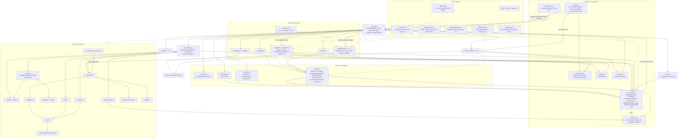

# Kiến trúc

Bản đồ do Tech Lead cập nhật (lần gần nhất: T-30755290). Agent đọc file này
trước khi làm để biết các phần đã có; sửa kiến trúc thì cập nhật sơ đồ.

```mermaid
flowchart TD
  subgraph Data["Dữ liệu và logic thuần"]
    API["src/api.ts<br/>GET /workers, tickets, events, needAction<br/>demo phòng 48 giây"]
    ACTV["src/activity.ts<br/>readAgentActivity, cacheRatio<br/>screenFor, bubbleFor, taskProgress<br/>withDemoActivity: cache 70–95% và agent thiếu cache"]
    USG["src/usage.ts<br/>parseUsage, usageLevel, countdown, isStale"]
    TK["src/tickets.ts<br/>phân loại, hành động, request, demo ticket"]
    TIME["src/time.ts<br/>relativeTime"]
    LATEST["src/latest.ts<br/>createLatestGate"]
    ATT["src/attention.ts<br/>tiêu đề tab, phím P, toast state"]
  end
  API --> TK
  ACTV -->|isIso| USG

  subgraph UIPure["src/ui — hàm thuần"]
    VP["viewport.ts<br/>computeInsets, fitScene"]
    FM["feed-model.ts<br/>reduceFeed"]
    SEL["selection.ts<br/>agentKey, resolveSelection, drawerView"]
    FMT["format.ts<br/>fmtNumber, fmtAgo, usageTile, agentStatus<br/>fmtTokenCount, tokenStatsLines<br/>nội dung cache và mức ok/warn/crit"]
  end
  FM --> ACTV
  FMT --> USG
  FMT --> ACTV

  subgraph UIDom["Panel DOM và CSS"]
    TOK["ui/tokens.css<br/>--lvl-ok, --lvl-warn, --lvl-crit"]
    TOP["ui/topbar.ts"]
    SIDE["ui/sidebar.ts + avatar.ts"]
    DRW["ui/drawer.ts + drawer.css<br/>Agent / Cần bạn<br/>Số liệu cache, token mới, fallback cũ"]
    FEED["ui/feed.ts"]
    TIP["agent-tooltip.ts + .css<br/>xem nhanh và số liệu cache<br/>làm mới mỗi giây"]
  end
  TOP --> FMT
  SIDE --> FMT
  SIDE --> CHAR
  DRW --> ACTV
  DRW --> FMT
  DRW --> TIME
  DRW --> TK
  TIP --> ACTV
  TIP --> FMT
  TIP --> TIME
  TOK -.-> DRW
  TOK -.-> TIP

  MAIN["src/main.ts<br/>polling, animation, chọn agent, đổi nguồn<br/>relayout, insets, fitScene"]
  API -->|workers giữ nguyên trường mở rộng| MAIN
  ACTV -->|bổ sung dữ liệu demo| MAIN
  LATEST --> MAIN
  ATT --> MAIN
  MAIN --> VP
  MAIN --> FM
  MAIN --> SEL
  MAIN --> TOP
  MAIN --> SIDE
  MAIN -->|render agent hiện tại| DRW
  MAIN --> FEED
  MAIN --> COL["needs-column.ts + .css"]
  COL --> TK
  COL --> LATEST
  COL -->|NeedSource.act| API
  COL --> NEEDS["#needs trong tab Cần bạn"]
  DRW --> NEEDS
  MAIN --> TOAST["toasts.ts + .css"]
  MAIN --> IDX["scene/index.ts<br/>drawScene, sceneSize, resetActors<br/>trả SceneFigure[]"]
  IDX --> ACTV
  MAIN --> OVL["overlay.ts<br/>bong bóng, tiến độ task"]
  OVL --> ACTV
  MAIN -->|figures, hitFigure, update| TIP

  subgraph Scene["Canvas và pixel art"]
    LAYOUT["layout.ts — thuần"]
    BOARD["usage-board.ts"]
    ACT["actors.ts<br/>seated khi cuối path bằng ghế hiện tại"]
    PATH["pathing.ts — thuần"]
    TILES["tiles.ts"]
    FURN["furniture.ts"]
    CHAR["characters.ts"]
    ART["art/characters/*.pixel.json"]
    PB["pixelbolt.ts"]
    LEG["legacy-characters.ts"]
    PAL["palette.ts"]
    PIX["pixel.ts"]
    CANVAS["canvas #office trong #stage"]
  end
  IDX --> LAYOUT
  IDX --> BOARD
  BOARD --> USG
  IDX --> ACT
  ACT --> LAYOUT
  ACT --> PATH
  IDX --> TILES
  IDX --> FURN
  IDX --> CHAR
  ART -->|import.meta.glob| CHAR
  CHAR --> PB
  CHAR --> LEG
  CHAR --> PAL
  PB --> PIX
  TILES --> PIX
  FURN --> PIX
  PIX --> CANVAS

  subgraph Tests["Vitest và build"]
    TA["activity.test.ts<br/>đọc phòng thủ, cacheRatio, demo"]
    TF["ui/format.test.ts<br/>định dạng, fallback, ngưỡng màu"]
    TD["ui/drawer.test.ts<br/>DOM số liệu và dữ liệu đổi giữa chừng"]
    TT["agent-tooltip.test.ts<br/>DOM, cập nhật, mất và trở lại"]
    TM["main.test.ts<br/>poll, lựa chọn, offline, đổi nguồn"]
    OTHER["test hiện có<br/>UI thuần, tickets, needs, scene, art"]
    CHECK["npm run build + npm test"]
  end
  TA -.-> ACTV
  TF -.-> FMT
  TD -.-> DRW
  TT -.-> TIP
  TM -.-> MAIN
  OTHER -.-> Scene
  CHECK -.-> Tests
```
